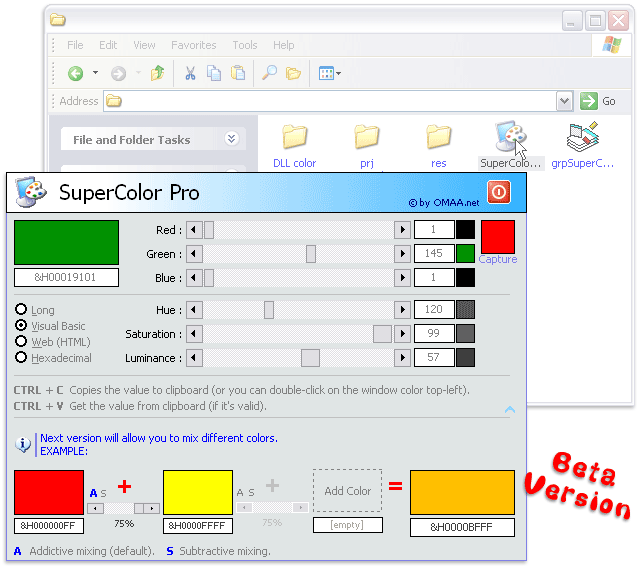



## SuperColor Pro

### Description

SuperColor Pro (beta) allows you to create colors, copy&paste to/from clipboard their values in different format: long, vb color, html color, hex color. You can use RGB, HSV or YUV space and you can even mix different colors.

The application comes with a DLL to operate with colors (rgb, hsv, yuv & mixing). The DLL can be used in ASP also.

Some skinning feature also, as you can see from the screenshot.
 
### More Info
 

             |
---                |---
**Submitted On**   |2002-08-18 01:47:42
**By**             |[Oscar Mucchiati](https://github.com/Planet-Source-Code/PSCIndex/blob/master/ByAuthor/oscar-mucchiati.md)
**Level**          |Intermediate
**User Rating**    |4.5 (18 globes from 4 users)
**Compatibility**  |VB 5\.0, VB 6\.0, ASP \(Active Server Pages\) 
**Category**       |[Complete Applications](https://github.com/Planet-Source-Code/PSCIndex/blob/master/ByCategory/complete-applications__1-27.md)
**World**          |[Visual Basic](https://github.com/Planet-Source-Code/PSCIndex/blob/master/ByWorld/visual-basic.md)
**Archive File**   |[SuperColor1194118172002\.zip](https://github.com/Planet-Source-Code/oscar-mucchiati-supercolor-pro__1-38059/archive/master.zip)

